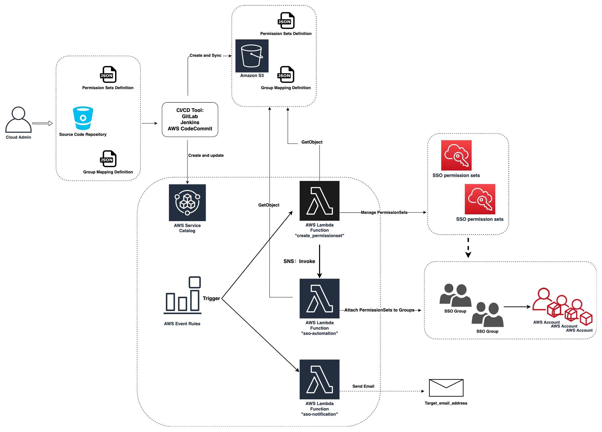

# CICD to Automate SSO Permission sets Mapping and Assignments for AWS Organizations

## Background Information

AWS Single Sign-On (SSO) adds new account assignment APIs and AWS CloudFormation support to automate access across AWS Organizations accounts on Sep 10, 2020. With those available SSO APIs, this solution allows all access provided via the SSO services to be automated via API / CloudFormation templates, and managed as code converting all currently manual activities.

AWS SSO requires the [AWS Organizations service](https://console.aws.amazon.com/organizations) enabled in your AWS account.

## What this solution is (IaC Checkride)
 - All the Source code is stored in AWS CodeCommit
 - Use AWS CodePipeline to provision and manage CloudFormation stacks the associated Resources such as CloudWatch Event
    - The AWS CodePipeline first deploy CloudFormation stacks using the templates in CodeCommit Repo
    - Once the CloudFormation stack is completed, CodePipeline syncs all the mapping files to a Secure S3 bucket
    - Pipeline invokes the Lambda to create SSO resources by referring the JSON file in the s3 bucket.
## Solution Instruction

## Prerequiest 
1. Make sure [S3 Data event](https://docs.aws.amazon.com/awscloudtrail/latest/userguide/logging-data-events-with-cloudtrail.html) is enabled for SSO source S3 bucket in account's CloudTrail service.
    - Because this solution uses AWS S3 Object-level API to trigger the lambda automation and this Data events are enabled by default. [Additional charges apply](https://aws.amazon.com/cloudtrail/pricing/)
    
### What is included in this Solution

```t
1. An AWS CloudFormation template "s3bucket.template"  which is used to store permission set files, group mapping file and lambda function zip code. 
    - The SSO lambda python code is stored in this bucket because other s3 buckets (e.g.shared-services bucket or other add-on buckets) may not exist prior to this SSO solution in the new environment.

2. An AWS service catalog product deploys the AWS resources for SSO permission sets and group assignment tasks.
    - Lambda functions "sso-permissionses-enabler","sso-automation-enabler", "sso-alert-SNSnotification"
    - IAM roles for Lambda functions.
    - AWS Events Rules that trigger lambda based on received AWS APIs 
    - SNS topics to send out email notifications for manual SSO modification.
```

### Use on-premises pipeline to sync changes to AWS environment (Optional)

```t
The following setups are required if you want to use local automation pipeline to sync SSO files to AWS S3:

1. On-premises automation application. We suggusts to use automation pipeline (e.g. Jenkins) to upload lambda zip files and JSON permission_sets and mapping files from on-premises source to the SSO s3 bucket.

2. The IAM Roles or IAM users which allow on-premises automation application to access AWS services and manage the SSO KMS key.

3. A (on-premises ) GitLab, GitHub or Bitbucket directory that contains the permission sets definition files, group mapping information for your organization. Each permission set is designed to have its own definition JSON file so that it can be quickly updated/added/removed without affecting other existing resources.

For example: The folder and files that will be uploaded/stored in your SSO s3 bucket "example-sso-s3-bucket":
    example-sso-s3-bucket/            
        - <lambda_file1>.zip
        - <lambda_file2>.zip                                        
        - global-mapping.json
        - target-mapping.json
        - permission_sets/
            - permissionset_expample_1.json
            ...             
            - permissionset_expample_99.json
```

### How to implement this solution in Organization primary account:
- 1) Manually or use any local automation pipeline (eg: Jenkins pipeline ) to create a s3 bucket for this SSO automation solution (KMS encrypted by default) using sso-s3-bucket.template file. 
- 2) Permission sets definition JSON files and mapping definition files are created and uploaded to a source code repository (e.g.GitLab or Bitbucket). You can create those mapping files manually or use the gernerate-sso-mapping.py helper script to convert your existing permission sets and assignments to mapping files.
- 3) Manually or use any automation pipeline to upload files (lambda zip files, global and target mapping files and 'permission_sets' folder) from source code repository or local storage to the SSO S3 bucket.
- 4) Provision sso-automation.template via AWS Service Catalog. Alternatively your can directly provision the template using CloudFormation service.
- 5) Test the automation solution and review the Lambda cloudwatch log for further debugging information.

### Architecture Diagram
  
  

### This solution covers following scenarios:
- If any change had been made through other approach without updating JSON mapping files in the source, such as a bitbucket, will this solution be able to detect and fix those drifts? 
    -   A: Yes. The automation will use the mapping definitions (synchronized from bitbucket repository) as the single source of truth(SSOT). When the lambda automation function runs, it compares the information in loaded mapping definitions and assignments in current environment. So it's able to find and address the drifts by re-provisioning the missing assignments and removing the additional assignments from AWS SSO service.

    The following s3 bucket policy will block all PutObject/DeleteObject actions to this SSO s3 bucket, Except the privileged sso automation role. This ensures no one other than privileged automation pipeline role is able to change the content of the mapping definition file in s3 bucket. 
```
          - Sid: OnlyAllowObjectUpdateJenkinsRole1
            Action:
              - s3:DeleteObject
              - s3:DeleteObjectVersion
              - s3:PutObject
              - s3:PutObjectAcl
            Effect: Deny
            Principal: "*"
            Resource: 
              !Sub arn:aws:s3:::${rS3Bucket}/*
            Condition:
              ArnNotLike:
                aws:PrincipalArn: !Ref pSSOAutmationRole
```
  - Another bucket policy blocks all PutBucketPolicy and DeleteBucketPolicy actions if those request are not from AWSCloudFormationStackSetExecutionRole or privileged sso automation role.
```
          - Sid: OnlyAllowObjectUpdateJenkinsRole2
            Action:
              - s3:PutBucketPolicy
              - s3:DeleteBucketPolicy
            Effect: Deny
            Principal: "*"
            Resource: 
              !Sub arn:aws:s3:::${rS3Bucket}
            Condition:
              ArnNotLike:
                aws:PrincipalArn: 
                  - !Ref pJenksinIamARN
                  - !Sub 'arn:aws:iam::${AWS::AccountId}:role/AWSCloudFormationStackSetExecutionRole'
```
### Detect the manual modifications to the SSO serivce to trigger immediate baseline actions.
- Added 2 AWS event rules in the Service Catalog produt templates:

    - SSOManualActionDetectionRule1
      - Monitor the APIs from source 'sso.amazonaws.com'
    - SSOManualActionDetectionRule2
      - Monitor the APIs from source 'sso-directory.amazonaws.com'

These 2 event rules will trigger the SSO lambda function when AWS detects manual write changes to SSO Service. Those AWS events will also trigger lambda function to send out Email notification to administrators via SNS serivce. 

### An existing permission set needs to be updated in all accounts it is mapped to.

- This Service Catalog Lambda function will make "ProvisionPermissionSet" SSO API call to update assignment status after it detects any updates to the existing permission sets.

### An existing permission set is deleted
-  This solution will detach the permission set from all mapped account before deleting.

### When a new AWS account is created, or an existing AWS account is invited to the current organization.
- This solution detects the API calls "CreateAccount" and "InviteAccountToOrganization" and use them to trigger the SSO group assignment tasks.

### A single AD group needs permission set A for account 1, and permission set B for account 2.
-  The solution covers this usecase. For example, we can add following content to "target-mapping-definition.json" file, so that lambda function will perform 2 separate assignments so we can attach this SSO group to account 111111111111 and 111111111111 with permission set A and attach the same SSO group to account 888888888888 and 999999999999 with permission set B: 
  ```

    [
        {
            "TargetGroupName": "SSO_Target_Group_A",
            "PermissionSetName": [
                "<Name_permission_set_A>"  ],
            "TargetAccountid": [
                "111111111111",
                "222222222222"
            ]
        },
        {
            "TargetGroupName": "SSO_Target_Group_B",
            "PermissionSetName": [
                "<Name_permission_set_B>" ],
            "TargetAccountid": [
                "888888888888",
                "999999999999"
            ]
        },
        {       ....
        }
    ]
  ```
### A new AD group is created and needs an existing permission set and account mapping assigned to it.
- The new AD group can be added by updating the SSO global or target mapping JSON file.

### A new AD group is created and needs an existing permission set assigned to a new account / list of accounts.
- The new AD group can be added by updating the SSO global or target mapping JSON file.

### A new AD group is created and needs a new permission set assigned to existing or new accounts
- We need to first create a new permission set definition JSON file for the new permission set. Once the new permission set is created in primary account, then update the SSO group mapping JSON file to trigger the lambda function.

---

### Troubleshoot and Breakglass steps:
-  In the ***worst-case scenario***, SSO lambda automation might delete/detach some the SSO login profiles which will block all the SSO users and groups' access to AWS console and command line. In order to continue the troubleshooting process in such scenario, we need to create a temporary IAM user to get access to AWS services. Disregard following steps if you have *root* access to your AWS account.

Here are the recommended steps ( Run the following aws cli commands using other non-sso Admin user's programmatic access):

```
1) Create a temporary IAM user  
$aws iam create-user --user-name sso-rescue 

2) Grant the user AWS console access and create a password for log in
$aws iam create-login-profile --user-name sso-rescue  --password <Enter_your_own_temp_password> 

3) Attach some necessary permissions to the user to troubleshoot the problem.
$aws iam attach-user-policy --policy-arn arn:aws:iam::aws:policy/AWSLambda_FullAccess --user-name sso-rescue 

$aws iam attach-user-policy --policy-arn arn:aws:iam::aws:policy/AWSSSOMasterAccountAdministrator --user-name sso-rescue 

$aws iam attach-user-policy --policy-arn arn:aws:iam::aws:policy/AmazonS3ReadOnlyAccess --user-name sso-rescue 

4) Log in AWS console (https://aws.amazon.com/console/) using the new created IAM user's user name and password.
 - Use the Account id and the new created IAM user name and password.

5) After the troubleshoot/rescue process. Delete the IAM user via CLI or AWS console.
```
## Important Note:
- We can assign other necessary IAM policies to the temporary sso rescue IAM user. However if you decide to create a  **full-admin** IAM user in any AWS account. It's highly recommend to put a **MFA** on it.


## Examples of mapping files
1. Example of permission-set file (random account ids):
```
{
    "Name": "1-global-admin",
    "Description": "1-global-admin",
    "Tags": [
        {
            "Key": "sso-solution",
            "Value": "test"
        }
    ],
    "ManagedPolicies": [
        {
            "Name": "AdministratorAccess",
            "Arn": "arn:aws:iam::aws:policy/AdministratorAccess"
        }
    ],
    "InlinePolicies": []
}

```
2. Example of global mapping file:
```
[
    {
        "GlobalGroupName": "Example_1-global-admin",
        "PermissionSetName": [
            "1-global-admin"
        ],
        "TargetAccountid": "Global"
    },
    {
        "GlobalGroupName": "Example_2-global-reader",
        "PermissionSetName": [
            "2-global-reader"
        ],
        "TargetAccountid": "Global"
    },
]
```
3. Example of target mapping file:
```
[
    {
        "TargetGroupName": "Example_9-splunk-admin",
        "PermissionSetName": [
            "9-ops-enterprisemonitoring"
        ],
        "TargetAccountid": [
            "722415818373"
        ]
    },
	  {
        "TargetGroupName": "Example_10-network-engineering",
        "PermissionSetName": [
            "10-ops-networking"
        ],
        "TargetAccountid": [
            "722415818373",
			"307353872784",
			"672340315222",
			"204671127579"
        ]
    }
]
```
---
## License
(c) 2020 Amazon Web Services, Inc. or its affiliates. All Rights Reserved.
This AWS Content is provided subject to the terms of the AWS Customer Agreement available at
http://aws.amazon.com/agreement or other written agreement between Customer and Amazon Web Services, Inc.