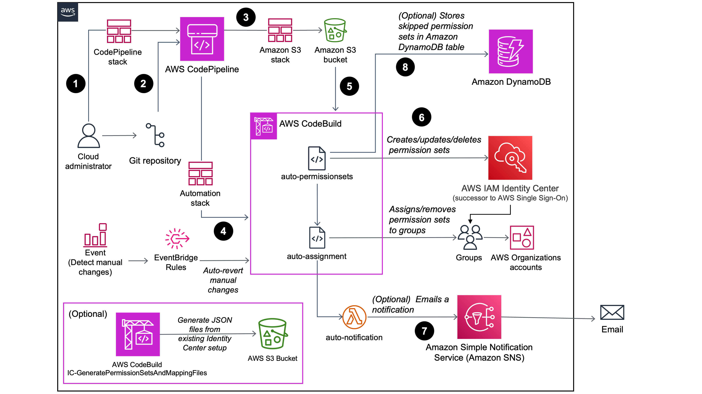

# CICD to Automate IAM Identity Center Permission sets Mapping and Assignments for AWS Organizations

## Background Information

AWS IAM Identity Center (successor to AWS Single Sign-On) provides account assignment APIs and AWS CloudFormation support to automate access across AWS Organizations accounts. With those available APIs, this solution allows all access provided via the IAM Identity Center services to be automated via API / CloudFormation templates, and managed as code converting all currently manual activities.

AWS IAM Identity Center requires the [AWS Organizations service](https://console.aws.amazon.com/organizations) enabled in your AWS account.

This solution is based on the AWS Blog - [Manage permission sets and account assignments in AWS IAM Identity Center with a CI/CD pipeline](https://aws.amazon.com/blogs/infrastructure-and-automation/manage-permission-sets-and-account-assignments-in-aws-iam-identity-center-with-a-ci-cd-pipeline/)

## What this solution is

- Use AWS CodeCommit or another git repository to securely source control your own IAM Identity Center code repository. Utilize CodePipeline to create and update CloudFormation stacks of IAM Identity Center and other AWS services.
- The AWS CodePipeline will first deploy CloudFormation stacks to create a security S3 bucket, automation Codebuild Projects and other AWS resources.
- Optional: This solution also allows you to generate permission set and mapping JSON files by reading your existing AWS IAM Identity Center configuration.
- Once the CloudFormation stack is completed, CodePipeline syncs all the mapping files to a Secure S3 bucket
- Pipeline invokes the CodeBuild Project to create IAM Identity Center resources by referring the JSON files in the s3 bucket and your repository.
- Pipeline sends you approval emails to Reject or Approve changes to Identity Center.
- Amazon EventBridge triggers email notifications via Amazon Simple Notification Service (SNS) on manual changes to Identity Center or in case of account changes in AWS Organizations and invokes CodeBuild Project to remove manual changes and revert back to baseline configuration.
- **This solution works with both Control Tower and non Control Tower (AWS Organizations) based landing zones.**

## Solution Implementation Instructions

## Prerequisite

1. AWS Organizations and IAM Identity Center are enabled.
2. [S3 Data event](https://docs.aws.amazon.com/awscloudtrail/latest/userguide/logging-data-events-with-cloudtrail.html) is enabled for IAM Identity Center source S3 bucket in account's CloudTrail service.
   - Because this solution uses AWS S3 Object-level API to trigger the CodeBuild automation and those Data events are enabled by default. [Additional charges apply](https://aws.amazon.com/cloudtrail/pricing/)

### Implementation

This solution can be implemented in Organization Management account or a delegated administrator (recommended) acount for Identity Center. It is recommended to delegate administrator for Identity Center to a separate member account dedicated for identity and access management to reduce exposure to management account and for better control over account access. Follow the appropriate instructions below depending on where you configure Identity Center, Organization Management account or a member account delegated as an administrator for Identity Center.

### Consideration

**Important note if you have AWS Control Tower enabled**
If your AWS IAM Identity Center user account is disabled, you'll get an error message when trying to provision new accounts in Account Factory. You can re-enable your IAM Identity Center user in the IAM Identity Center console.

AWS Control Tower also offers preconfigured groups to organize users that perform specific tasks in your accounts. AWS Control Tower creates these groups and assigns pre-configured permission sets to these groups and provisions them in the Organization Management account. You can also [view the list of groups and corresponding permission sets](https://docs.aws.amazon.com/controltower/latest/userguide/sso.html#sso-groups). You can choose to disable this setting in Control Tower when deploying or modifying Landing Zone, by selecting "Self-managed AWS account access with IAM Identity Center or another method" or "AWS Control Tower sets up AWS account access with IAM Identity Center" under "AWS account access configuration".

**AWS Control Tower requires these permission sets to exist for account creation and provisioning purposes**. If you chose "AWS Control Tower sets up AWS account access with IAM Identity Center" above, and to ensure that this solution does not de-provision or delete the Control Tower permission sets, you **must tag AWS Control Tower created permission sets** with `"key:ManagedBy"` and `"value:ControlTower"` before deploying the solution, if you choose to deploy it in the Management account. Additionally, update the value of _"ControlTowerEnabled"_ to "true" as mentioned in the implementation steps below. Tagging Control Tower managed permission sets is not required when deploying in delegated admin account as those permission sets and corresponding assignments are skipped by default.

**Navigate to the appropriate implementation steps below depending on your choice of deployment in the Management account or a delegated admin account for AWS IAM Identity Center**

### How to implement this solution in member account delegated administrator for Identity Center (Recommended):

### Consideration

Delegated administration provides a convenient way for assigned users in a registered member account to perform most IAM Identity Center administrative tasks. When you enable IAM Identity Center, your IAM Identity Center instance is created in the management account in AWS Organizations by default. This was originally designed this way so that IAM Identity Center can provision, de-provision, and update roles across all your organization's member accounts. Even though your IAM Identity Center instance must always reside in the management account, you can choose to delegate administration of IAM Identity Center to a member account in AWS Organizations, thereby extending the ability to manage IAM Identity Center from outside the management account. For more details, visit https://docs.aws.amazon.com/singlesignon/latest/userguide/delegated-admin.html#delegated-admin-tasks-member-account

Enabling delegated administration provides the following benefits: - Minimizes the number of people who require access to the management account to help reduce exposure and mitigate security concerns - Allows select administrators to assign users and groups to applications and to your organization's member accounts - Disallow delegated administrator for Identity Center from making changed to permissions provisioned for management account, following the zero trust principles.

**Delegated administrator cannot manage permission sets provisioned in the management account**
This is by design to prevent delegated administrator from adding/updating/removing permissions to the management account, which is considered to be the account with the most elevated permissions and should have the least exposure.

This solution works around this by skipping the permission sets provisioned in the management account and storing a list of skipped permission sets in a DynamoDB table "IC-SkippedPermissionSets". This is also true for Control Tower based landing zones.

As delegated admin is not allowed to manage permission sets provisioned in management account or assign a permission set to the management account, you must manually create a permission set in the management account, to use just for the management account. For more details, view [best practices for delegated administrator for Identity Center](https://docs.aws.amazon.com/singlesignon/latest/userguide/delegated-admin.html#delegated-admin-best-practices).

This also recommended as a best practice:

> Create permission sets for use only in the management account – This makes it easier to administer permission sets tailored just for users accessing your management account and helps to differentiate them from permission sets managed by your delegated administrator account.

**If you have already delegated an AWS account as administrator for Identity Center, follow the steps listed under _Deployment in delegated administrator account_ section below. If you have not delegated an AWS account as administrator for Identity Center yet, perform the following steps to delegate a member account as an administrator for Identity Center:**

1. [Clone/fork](#downloading-and-keeping-the-solution-up-to-date) this repository. cd into the repository root directory.
2. Navigate to templates/delegate-admin/, where you will find the IC-Delegate-Admin.template CloudFormation template.
3. In the Organization Management account, create a stack in AWS CloudFormation console at https://console.aws.amazon.com/cloudformation.
4. On the Specify stack details page, type a stack name in the Stack name box. You can choose any name, such as, _delegate-IC-admin_.
5. In the Parameters section, specify the following parameters:
   - delegate: true
   - accountid: 123456789012 (Account Id of the account you'd like to delegate as administrator)
6. Choose Next to proceed with setting options for your stack and create the stack.
7. Once the CloudFormation stack is created successfully, follow the steps under Deployment section below.

## Implementation

### Deployment in delegated administrator account

1. [Clone/fork](#downloading-and-keeping-the-solution-up-to-date) this repository. cd into the repository root directory.
2. Create an AWS CodeCommit repository or a [CodeConnection connection](https://docs.aws.amazon.com/dtconsole/latest/userguide/connections-create.html) to connect to your git repository. The AWS CodeCommit repository or the CodeConnection Connection must exist prior to deploying codepipeline-stack.template in next step.
   - If you chose CodeCommit, the name of CodeCommit repository will be used when we create pipeline with codepipeline-stack.template.
   - If you created a CodeConnection Connection, the full connection ARN of the CodeConnection Connection will be used when we create pipeline with codepipeline-stack.template.
3. Specify parameter values in _identity-center-stacks-parameters.json_ file in the repository. Those parameters will be used by the CodePipeline to create other 2 CloudFormation stacks.
   - The value of _"ICMappingBucketName"_ parameter is used by both codepipeline-stack.template and identity-center-stacks-parameters.json, must be same.
   - As you've chosen to manage Identity Center in a delegated administrator account, the value of _"AdminDelegated"_ must be **true**.
   - If you have Control Tower enabled, change the value of _"ControlTowerEnabled"_ to "true", else, keep it "false".
   - If you have an existing IAM role or a user to manage Identity Center without triggering notifications for manual changes, add the ARN of the existing IAM role or user to _"ICAutomationAdminArn"_ and change the value of _"createICAdminRole"_ to "false". If you do not have an existing IAM role or a user, leave the value of _"ICAutomationAdminArn"_ empty '' and change the value of _"createICAdminRole"_ to true and the solution will create an IAM role for you.
   - If you have an existing IAM role or a user to administer KMS key used to encrypt S3 bucket for Identity Center solution, without triggering notifications for manual changes, add the ARN of the existing IAM role or user to _"ICKMSAdminArn"_ and change the value of _"createICKMSAdminRole"_ to "false". If you do not have an existing IAM role or a user, leave the value of _"ICKMSAdminArn"_ empty '' and change the value of _"createICKMSAdminRole"_ to true and the solution will create an IAM role for you.
   - You can provide your email address or a distribution list as avalue for _"SNSEmailEndpointSubscription"_ to receive SNS notifications for manual changed detected within Identity Center.
   - If you'd like the solution to create a KMS key to encrypt ICMappingBucket, set _"createS3KmsKey"_ to "true". Alternatively, if you wish to use an existing KMS key, set the _"createS3KmsKey"_ to false and provide your KMS key ARN to _"S3KmsArn"_. Please note that if you choose to provide your KMS key, you'd need to ensure proper KMS key policy and management.
4. In your delegated administrator account, use the templates/codepipeline-stack.template cloudformation template to provision the AWS Code Pipeline and related CICD resources in the same region that IAM Identity Center service is enabled. On the Specify stack details page, type a stack name in the Stack name box. You can choose any name, such as, _id-center-pipeline-stack_.
5. In the Parameters section, specify the following parameters:
   - _GeneratePermissionSetsAndMappings_: Set to true if you want to deploy a separate build project to generate permission sets and mapping JSON files, ONLY if you are already using Identity Center and would like to import existing permission sets and assignments into this solution. See Step 6 below for details.
   - _ICInstanceARN_: Required when GeneratePermissionSetsAndMappings is set to true. ICInstanceARN can be found on the AWS IAM Identity Center console 'Settings' page.
   - _IdentityStoreId_: Required when GeneratePermissionSetsAndMappings is set to true. Identity Store ID can be found on the AWS IAM Identity Center console 'Settings' page.
   - _AutomationBuildProjectName_: Specify the name for the automation CodeBuild projects or leave default.
   - _ICMappingBucketName_: The same bucket name will be used in the automation and s3 stack. This S3 bucket is used to store the permission sets and mapping files. **Specify the same name you have specified in identity-center-stacks-parameters.json**.
   - _SourceType_: Choose the source type for your pipeline (AWS CodeCommit or CodeConnection Connection).
   - _ConnectionArn_: The ARN of the CodeConnection connection (**required if you set SourceType as CodeConnection**).
   - _RepositoryName_: The name of the repository (full name of repository with path for CodeConnection Connection; repository name for AWS CodeCommit).
   - _RepoBranch_: The name of branch that will trigger the CodePipeline run. Default is 'main'.
   - _SNSPipelineApprovalEmail_: The email that will receive and approve pipeline approval notifications.
   - _OrgManagementAccount_: Account Id of the Organizations management account.
6. (Optional) If you set _GeneratePermissionSetsAndMappings_ to 'true', upload the _src/automation-code/permission-set-and-mapping-files-generator/auto-generate-permissionsets-mapping-files.py_ file to the root of the S3 bucket (Bucket name starts with 'icpermsetmapping'). Once uploaded, an EventBridge Rule will automatically trigger the CodeBuild Project to generate necessary JSON files and directory structure. You can navigate to CodeBuild > Build Projects > IC-GeneratePermissionSetsAndMappingFiles to check the status of the build. This will read your existing Identity Center configuration and generate a _identity-center-mapping-info_ folder with necessary files in the S3 Bucket, which you can use in the next step before running the automation. **Verify the permission sets and mapping files generated before using those for implementation**.
7. Create your own permission sets json defination files as well as the account assignment defination file "global-mapping.json" and "target-mapping.json". Note, if you chose to perform the optional Step 6 above, the existing permission sets and mapping files will be in the S3 bucket. You can replace the files in _identity-center-mapping-info_ folder in this repository with the one generated in the S3 bucket.
8. Push the following files to your CodeCommit repository, e.g. Linux tree structure:

```
.
├── CHANGELOG.md
├── CODE_OF_CONDUCT.md
├── CONTRIBUTING.md
├── LICENSE
├── README.md
├── diagram
│   └── architecture_diagram.png
├── identity-center-mapping-info
│   ├── global-mapping.json
│   ├── permission-sets
│   │   ├── 1-example-admin.json
│   │   ├── 2-example-readonly.json
│   │   ├── 3-example-billing.json
│   │   ├── 4-example-operations.json
│   │   ├── 5-example-sec-readonly.json
│   │   ├── 6-example-cx-managed-boundary.json
│   │   └── 7-example-aws-managed-boundary.json
│   └── target-mapping.json
├── identity-center-stacks-parameters.json
├── src
│   ├── automation-code
│   │   ├── identity-center-auto-assign
│   │   │   ├── auto-assignment.py
│   │   │   └── cfnresponse.py
│   │   ├── identity-center-auto-permissionsets
│   │   │   ├── auto-permissionsets.py
│   │   │   └── cfnresponse.py
│   │   └── permission-set-and-mapping-files-generator
│   │       └── auto-generate-permissionsets-mapping-files.py
│   ├── codebuild
│   │   ├── buildspec-mapping.yml
│   │   ├── buildspec-param.yml
│   │   ├── buildspec-validation.yml
│   │   └── buildspec-zipfiles.yml
│   └── validation
│       └── syntax-validator.py
└── templates
    ├── codepipeline-stack.template
    ├── delegate-admin
    │   ├── IC-Delegate-Admin.template
    │   └── IC_delegate_admin_main.py
    ├── identity-center-automation.template
    ├── identity-center-s3-bucket.template
    └── management-account-org-events-forwarder.template
```

9. The pipeline will automatically create 2 new CloudFormation stacks _IdentityCenter-S3-Bucket-Stack_ and _IdentityCenter-Automation-Stack_ in your account and upload your permission sets and mapping files to a centralized S3 bucket. The non-default parameters are specified in identity-center-stacks-parameters.json file.
10. The 'ReviewAndExecute' stage needs manual approval before the Pipeline invoke the CodeBuild Project. Once the pipeline is completed, verify the permission sets and account mapping on the AWS IAM Identity Center service console.

#### (Optional) Deploy event forwarder in Management account for automation in delegated administrator account to trigger automatically on Organizations API events

1. In your Organizations Management account us-east-1 region, use the templates/management-account-org-events-forwarder.template cloudformation template to create an EventBridge event forwarder rule and a corresponding IAM role, to forward Organization API events such as MoveAccount, CreateOrganizationUnit, AcceptHandshake (for invited accounts) to the Event Bus in delegated administrator account. On the Specify stack details page, type a stack name in the Stack name box. You can choose any name, such as, _ic-orgEventsForwarder_.
   **Note** - This tempalte must be deployed in us-east-1 region in the management account as AWS Organizations is a global service and the it's events exist only in us-east-1 region.
2. In the Parameters section, specify the following parameters:
   - _IdcDelegatedAccountId_: AWS Account ID of the delegated administrator account for Identity Center where you deployed the above pipeline.
   - _TargetRegion_: Target region in your delegated administrator account for Identity Center where Identity Center is enabled and the above pipeline is deployed.
3. Ensure that the stack is successfully deployed or resolve any errors.
4. Organizations events will now be forwarded to the delegated administrator account and will trigger the automation on certain actions to baseline your permissions and assignments.

### Deployment in Organization Management account:

1. [Clone/fork](#downloading-and-keeping-the-solution-up-to-date) this repository. cd into the repository root directory.
2. Create an AWS CodeCommit repository or a [CodeConnection connection](https://docs.aws.amazon.com/dtconsole/latest/userguide/connections-create.html) to connect to your git repository. The AWS CodeCommit repository or the CodeConnection Connection must exist prior to deploying codepipeline-stack.template in next step.
   - If you chose CodeCommit, the name of CodeCommit repository will be used when we create pipeline with codepipeline-stack.template.
   - If you created a CodeConnection Connection, the full connection ARN of the CodeConnection Connection will be used when we create pipeline with codepipeline-stack.template.
3. Specify parameter values in _identity-center-stacks-parameters.json_ file in the repository. Those parameters will be used by the CodePipeline to create other 2 CloudFormation stacks.
   - The value of _"ICMappingBucketName"_ parameter is used by both codepipeline-stack.template and identity-center-stacks-parameters.json, must be same.
   - As you've chosen to manage Identity Center in Organization Management account, the value of AdminDelegated must be **false**.
   - If you have Control Tower enabled, change the value of _"ControlTowerEnabled"_ to "true", else, keep it "false".
   - If you have an existing IAM role or a user to manage Identity Center without triggering notifications for manual changes, add the ARN of the existing IAM role or user to _"ICAutomationAdminArn"_ and change the value of _"createICAdminRole"_ to "false". If you do not have an existing IAM role or a user, leave the value of _"ICAutomationAdminArn"_ empty '' and change the value of _"createICAdminRole"_ to true and the solution will create an IAM role for you.
   - If you have an existing IAM role or a user to administer KMS key used to encrypt S3 bucket for Identity Center solution, without triggering notifications for manual changes, add the ARN of the existing IAM role or user to _"ICKMSAdminArn"_ and change the value of _"createICKMSAdminRole"_ to "false". If you do not have an existing IAM role or a user, leave the value of _"ICKMSAdminArn"_ empty '' and change the value of _"createICKMSAdminRole"_ to true and the solution will create an IAM role for you.
   - You can provide your email address or a distribution list as avalue for _"SNSEmailEndpointSubscription"_ to receive SNS notifications for manual changed detected within Identity Center.
   - If you'd like the solution to create a KMS key to encrypt ICMappingBucket, set _"createS3KmsKey"_ to "true". Alternatively, if you wish to use an existing KMS key, set the _"createS3KmsKey"_ to false and provide your KMS key ARN to _"S3KmsArn"_. Please note that if you choose to provide your KMS key, you'd need to ensure proper KMS key policy and management.
4. In your AWS Organization Management account, use the codepipeline-stack.template cloudformation template to provision the AWS Code Pipeline and related CICD resources in the same region that IAM Identity Center service is enabled. On the Specify stack details page, type a stack name in the Stack name box. You can choose any name, such as, _id-center-pipeline-stack_.
5. In the Parameters section, specify the following parameters:
   - _GeneratePermissionSetsAndMappings_: Set to true if you want to deploy a separate build project to generate permission sets and mapping JSON files, ONLY if you are already using Identity Center and would like to import existing permission sets and assignments into this solution. See Step 6 below for details.
   - _ICInstanceARN_: Required when GeneratePermissionSetsAndMappings is set to true. ICInstanceARN can be found on the AWS IAM Identity Center console 'Settings' page.
   - _IdentityStoreId_: Required when GeneratePermissionSetsAndMappings is set to true. Identity Store ID can be found on the AWS IAM Identity Center console 'Settings' page.
   - _AutomationBuildProjectName_: Specify the name for the automation CodeBuild projects or leave default.
   - _ICMappingBucketName_: The same bucket name will be used in the automation and s3 stack. This S3 bucket is used to store the permission sets and mapping files. **Specify the same name you have specified in identity-center-stacks-parameters.json**.
   - _SourceType_: Choose the source type for your pipeline (AWS CodeCommit or CodeConnection Connection).
   - _ConnectionArn_: The ARN of the CodeConnection connection (**required if you set SourceType as CodeConnection**).
   - _RepositoryName_: The name of the repository (full name of repository with path for CodeConnection Connection; repository name for AWS CodeCommit).
   - _RepoBranch_: The name of branch that will trigger the CodePipeline run. Default is 'main'.
   - _SNSPipelineApprovalEmail_: The email that will receive and approve pipeline approval notifications.
   - _OrgManagementAccount_: Account Id of the Organizations management account.
6. (Optional) If you set _GeneratePermissionSetsAndMappings_ to 'true', upload the _src/automation-code/permission-set-and-mapping-files-generator/auto-generate-permissionsets-mapping-files.py_ file to the root of the S3 bucket (uckent name starts with 'icpermsetmapping'). Once uploaded, an EventBridge Rule will automatically trigger the CodeBuild Project to generate necessary JSON files and directory structure. You can navigate to CodeBuild > Build Projects > IC-GeneratePermissionSetsAndMappingFiles to check the status of the build. This will read your existing Identity Center configuration and generate a _identity-center-mapping-info_ folder with necessary files in the S3 Bucket, which you can use in the next step before running the automation. **Verify the permission sets and mapping files generated before using those for implementation**.
7. Create your own permission sets json defination files as well as the account assignment defination file "global-mapping.json" and "target-mapping.json". Note, if you chose to perform the optional Step 6 above, the existing permission sets and mapping files will be in the S3 bucket. You can replace the files in _identity-center-mapping-info_ folder in this repository with the one generated in the S3 bucket.
8. Push the following files to your git repository, e.g. Linux tree structure:

```
.
├── CHANGELOG.md
├── CODE_OF_CONDUCT.md
├── CONTRIBUTING.md
├── LICENSE
├── README.md
├── diagram
│   └── architecture_diagram.png
├── identity-center-mapping-info
│   ├── global-mapping.json
│   ├── permission-sets
│   │   ├── 1-example-admin.json
│   │   ├── 2-example-readonly.json
│   │   ├── 3-example-billing.json
│   │   ├── 4-example-operations.json
│   │   ├── 5-example-sec-readonly.json
│   │   ├── 6-example-cx-managed-boundary.json
│   │   └── 7-example-aws-managed-boundary.json
│   └── target-mapping.json
├── identity-center-stacks-parameters.json
├── src
│   ├── automation-code
│   │   ├── identity-center-auto-assign
│   │   │   ├── auto-assignment.py
│   │   │   └── cfnresponse.py
│   │   ├── identity-center-auto-permissionsets
│   │   │   ├── auto-permissionsets.py
│   │   │   └── cfnresponse.py
│   │   └── permission-set-and-mapping-files-generator
│   │       └── auto-generate-permissionsets-mapping-files.py
│   ├── codebuild
│   │   ├── buildspec-mapping.yml
│   │   ├── buildspec-param.yml
│   │   ├── buildspec-validation.yml
│   │   └── buildspec-zipfiles.yml
│   └── validation
│       └── syntax-validator.py
└── templates
    ├── codepipeline-stack.template
    ├── delegate-admin
    │   ├── IC-Delegate-Admin.template
    │   └── IC_delegate_admin_main.py
    ├── identity-center-automation.template
    ├── identity-center-s3-bucket.template
    └── management-account-org-events-forwarder.template
```

9. The pipeline will automatically create 2 new CloudFormation stacks _IdentityCenter-S3-Bucket-Stack_ and _IdentityCenter-Automation-Stack_ in your account and upload your permission sets and mapping files to a centralized S3 bucket. The non-default parameters are specified in identity-center-stacks-parameters.json file.
10. The 'ReviewAndExecute' stage needs manual approval before the Pipeline invoke the CodeBuild Project. Once the pipeline is completed, verify the permission sets and account mapping on the AWS IAM Identity Center service console.

**Note:** If you chose to create IAM role for Identity Center and KMS admin, the ARNs of those roles can be found in the output tab of the _IdentityCenter-S3-Bucket-Stack_ in AWS CloudFormation console. To make manual changes to Identity Center without triggering notifications, you can assume the _ICAdminRole_ role. View steps on [how to assume a role](https://docs.aws.amazon.com/IAM/latest/UserGuide/id_roles_use_switch-role-console.html).

## Architecture Diagram



### 1. Permission Set JSON file structure and example

Note:

1. Only use the "CustomerPolicies" object in the definition file if you need to apply customer managed policy to your permission set. When you create a permission the set with a customer managed policy, you MUST create an IAM policy with the same name and path in each AWS account where IAM Identity Center assigns your permission set FIRST before attaching it to the permission set. If you are specifying a custom path, make sure to specify the same path in each AWS account.
2. Only use the "PermissionBoundary" object in the definition file if you need to apply an AWS managed policy, or a customer managed policy as a permissions boundary to your permission set. When you create a permission the set with a permissions boundary using a customer managed policy, you MUST create an IAM policy with the same name and path in each AWS account where IAM Identity Center assigns your permission set FIRST before attaching it to the permission set. If you are specifying a custom path, make sure to specify the same path in each AWS account.
   Alternatively, you can choose to use an AWS managed policy for the permissions boundary, which won't require you to create any IAM policies as AWS managed policies pre-exist in all AWS accounts.
3. You can apply custom permission set _session duration_ for selected permission by adding "Session_Duration" in the mapping file (e.g 1-example-admin). You can set your own default permission set "SessionDuration" in the identity-center-automation.template or using identity-center-stacks-parameters.json file, current default value is 1 hour.

#### 1.1 Valid Permission Set JSON structure

```
    required_keys = {
        "Name": str,
        "Description": str
    }

    optional_keys = {
        "Tags": list,
        "ManagedPolicies": list,
        "InlinePolicies": (list, dict),
        "CustomerPolicies": list,
        "Session_Duration": str,
        "PermissionsBoundary": dict
    }
```

#### 1.2 Example of valid permission set

```
    {
    "Name": "example-admin",
    "Description": "Admin access",
    "Session_Duration": "PT12H",
    "Tags": [
        {
            "Key": "env",
            "Value": "prod"
        },
        {
            "Key": "identity-center-solution",
            "Value": "example"
        }
    ],
    "ManagedPolicies": [
        {
            "Name": "AdministratorAccess",
            "Arn": "arn:aws:iam::aws:policy/AdministratorAccess"
        }
    ],
    "CustomerPolicies": [
        {
            "Name": "customer-managed-policy-1",
            "Path": "/IAM-path-example/"
        },
        {
            "Name": "customer-managed-policy-2",
            "Path": "/"
        }
    ],
    "InlinePolicies": [
        {
            "Version": "2012-10-17",
            "Statement": [
                {
                    "Sid": "BillingReader",
                    "Effect": "Allow",
                    "Action": "budgets:ViewBudget",
                    "Resource": "*"
                },
                {
                    "Sid": "APIAccess",
                    "Effect": "Allow",
                    "Action": "apigateway:GET",
                    "Resource": "arn:aws:apigateway:us-west-2::/apis"
                }
            ]
        }
    ],
    "PermissionsBoundary": {
        "Name": "testPermissionBoundary",
        "Path": "/"
        }
    }
```

Permissions Boundary with AWS Managed policy as opposed to customer managed policy in the example above:

```
"PermissionsBoundary": {
        "Name": "ViewOnlyAccess",
        "Arn": "arn:aws:iam::aws:policy/job-function/ViewOnlyAccess"
    }
```

### 2. Mapping files JSON structure and example

#### 2.1 Valid Global Mapping JSON structure

```
    required_keys = {
        "GlobalGroupName": str,
        "PermissionSetName": list[str]
        "Target": str
    }
```

#### 2.2 Example of global mapping file

```
[
    {
        "GlobalGroupName": "Example_1-global-admin",
        "PermissionSetName": [
            "1-example-admin"
        ],
        "Target": "Global"
    },
    {
        "GlobalGroupName": "Example_2-global-reader",
        "PermissionSetName": [
            "2-example-readonly",
            "example-viewonly"
        ],
        "Target": "Global"
    },
]
```

#### 2.3 Valid Target Mapping JSON structure

```
    required_keys = {
        "GlobalGroupName": str,
        "PermissionSetName": list[str]
        "Target": list[str,dict]
    }
```

#### 2.4 Example of target mapping file

Note: You can specify a 12-digit account ID, account name, or Organization Unit (OU) name (including nested OUs) as targets for permission set assignment. For account Id, you can specify a 12-digit account ID directly, for account name, use 'name:' prefix, and for OU name, use 'ou:' prefix.

```
[
    {
        "TargetGroupName": "Example_platform-engineering",
        "PermissionSetName": [
            "platform-PowerUserAccess"
        ],
        "Target": [
            {
                "OrganizationalUnits": [
                    "Infrastructure/Infra-Dev",
                    "Sandbox",
                    "Shared-Services/Development/Network"
                ]
            },
            {
                "Accounts": [
                    "Platform-Dev",
                    "Platform-Prod"
                ]
            }
        ]
    },
    {
        "TargetGroupName": "Example_10-network-engineering",
        "PermissionSetName": [
            "10-ops-networking",
            "ops-enterprisemonitorin"
        ],
        "Target": [
            "123456789012",
            "111111111111",
            "222222222222",
            "333333333333"
        ]
    }
]
```

### This solution covers the following scenarios:

- If any change had been made through another approach without updating JSON mapping files in the source, such as deleting a permission set, will this solution be able to detect and fix those drifts?

  - A: Yes. The automation will use the mapping definitions in the s3 bucket as the single source of truth. When the CodeBuild automation function runs, it compares the information in loaded mapping definitions and assignments in the current environment. So it's able to find and address the drifts by re-provisioning the missing assignments and removing the additional assignments from IAM Identity Center.

  The following s3 bucket policy will block all PutObject/DeleteObject actions to this IAM Identity Center s3 bucket, Except the privileged automation roles. This ensures no one other than privileged automation pipeline role is able to change the content of the mapping definition file in s3 bucket.

```
          - Sid: OnlyAllowObjectUpdateRole1
            Action:
              - s3:DeleteObject
              - s3:DeleteObjectVersion
              - s3:PutObject
              - s3:PutObjectAcl
            Effect: Deny
            Principal: "*"
            Resource:
              !Sub arn:aws:s3:::${rS3Bucket}/*
            Condition:
              ArnNotLike:
                aws:PrincipalArn:
                  - !Sub "arn:aws:iam::${AWS::AccountId}:role/ICAutoPipelineCodeBuildRole"
                  - !Ref ICAutomationAdminArn
```

- Another bucket policy blocks all PutBucketPolicy and DeleteBucketPolicy actions if those request are not from AWSCloudFormationStackSetExecutionRole or privileged automation role.

```
          - Sid: OnlyAllowObjectUpdateRole2
            Action:
              - s3:PutBucketPolicy
              - s3:DeleteBucketPolicy
            Effect: Deny
            Principal: "*"
            Resource:
              !Sub arn:aws:s3:::${rS3Bucket}
            Condition:
              ArnNotLike:
                aws:PrincipalArn:
                  - !Sub "arn:aws:iam::${AWS::AccountId}:role/ICAutoPipelineCodeBuildRole"
                  - !Ref ICAutomationAdminArn
```

    Additionally, the CodeBuild Project tracks and uses versioned objects in S3 to ensure integrity and prevent manual manipulation of configuration files.

### (Optional) Detect the manual modifications to the IAM Identity Center to trigger immediate baseline actions.

- There are 2 optional AWS event rules in the templates/identity-center-automation.template:

  - ICManualActionDetectionRule1
    - Monitor the APIs from source 'sso.amazonaws.com'
  - ICManualActionDetectionRule2
    - Monitor the APIs from source 'sso-directory.amazonaws.com'

These 2 event rules will trigger the CodeBuild project when AWS detects manual write changes to IAM Identity Center. Those AWS events will also trigger the lambda function to send out Email notification to administrators via SNS service.
Note - Events initiated from source 'sso-directory.amazonaws.com' will not be reverted as those are events related to users and groups. This is by design because customers may choose to integrate an external identity provider, such as EntraID, with Identity Center and the changes to users and groups must be done in the external identity provider.

### Can we use Account Name or Organization Unit (OU) Name and paths (nested), instead of Account ID?

- Yes, this solution allows you to use 12-digit account IDs, Account Names, and Organization Unit (OU) Names and paths at the same time for ease of use. For account ID, you can specify a 12-digit account ID directly, for account name, specify account names in Accounts list, and for OU name and paths, specify OU names and paths in OrganizationalUnits list. Example target mapping JSON configuration:

```

  [
      {
          "TargetGroupName": "Target_Group_A",
          "PermissionSetName": [
              "<Name_permission_set_A>"
              ],
          "Target": [
            {
                "OrganizationalUnits": [
                    "<OU_Name>>",
                    "<Nested_OU_Path>"
                ]
            },
            {
                "Accounts": [
                    "<Account_Name>"
                ]
            },
              "111111111111",
              "123456789012"
          ]
      },
      {
          "TargetGroupName": "Target_Group_B",
          "PermissionSetName": [
              "<Name_permission_set_B>"
              ],
          "Target": [
              "888888888888",
              "999999999999"
          ]
      },
      {       ....
      }
  ]
```

### An existing permission set needs to be updated in all accounts it is mapped to.

- The identity-center-auto-permissionsets function will make "ProvisionPermissionSet" IAM Identity Center API call to update assignment status after it detects any updates to the existing permission sets.

### An existing permission set is deleted

- This solution will detach the permission set from all mapped accounts before deleting.

### When a new AWS account is created, or an existing AWS account is invited to the current organization.

- This solution detects the API calls "CreateAccountResult" with SUCCEEDED status and "AccountJoinedOrganization" and uses them to trigger the IAM Identity Center group assignment tasks when a new account is successfully created or joined by invitation.

### A single AD or IAM Identity Center group needs permission set A for account 1, and permission set B for account 2.

- The solution covers this use case. For example, we can add following content to "target-mapping-definition.json" file, so that identity-center-auto-assignments function will perform 2 separate assignments so we can attach this IAM Identity Center group to account 111111111111 and 123456789012 with permission set A and attach the same IAM Identity Center group to account 888888888888 and 999999999999 with permission set B:

```

  [
      {
          "TargetGroupName": "Target_Group_A",
          "PermissionSetName": [
              "<Name_permission_set_A>"  ],
          "Target": [
              "111111111111",
              "123456789012"
          ]
      },
      {
          "TargetGroupName": "Target_Group_B",
          "PermissionSetName": [
              "<Name_permission_set_B>" ],
          "Target": [
              "888888888888",
              "999999999999"
          ]
      },
      {       ....
      }
  ]
```

### A new AD or Identity Center group is created and needs an existing permission set and account mapping assigned to it.

- The new AD or Identity Center group can be added by updating the global or target mapping JSON file.

### A new AD or Identity Center group is created and needs an existing permission set assigned to a new account / list of accounts.

- The new AD or Identity Center group can be added by updating the global or target mapping JSON file.

### A new AD or Identity Center group is created and needs a new permission set assigned to existing or new accounts

- We need to first create a new permission set definition JSON file for the new permission set. Once the new permission set is created in the Management account, then update the Identity Center group mapping JSON file to trigger the CodeBuild Project.

### ICAutomationAdmin Role was used to make a manual change to Identity Center without triggering the manual revert, in an event of an incident when waiting for the pipeline execution was not feasible.

- The ICScheduledRuleBaselining EventBridge Rule is configured to run every 12 hours to baseline permissions automatically by invoking the automation CodeBuild Project.

---

## Downloading and keeping the solution up-to-date

You can either clone or fork this repository and maintain an upstream connection with this repository to fetch the latest updates.

### If you fork the repository

1. Forking will create a copy this repository under your GitHub account or organization. clone your fork to your local environment:
   `git clone <your-fork-repositiry-url>`
2. cd aws-identitycenter-codepipeline-auto-assignment
3. Add this upstream repository as a remote:
   `git remote add upstream git@github.com:aws-samples/aws-identitycenter-codepipeline-auto-assignment.git`
4. Verify the remotes:
   `git remote -v`
   The output should show "origin" and "upstream". Where "origin" is the remote to your fork and "upstream" is the remote to this repository.
5. Here you can follow the implementation steps and customize the identity-center-stack-parameters.json and JSON files within identity-center-mapping-info directory to specific to your environment.
6. You can then add and commit your changes to your local before pushing it to your fork:
   `git add . && git commit -m "Updating parameters, permission sets and mapping files"`
7. Push your changes to your fork to trigger the pipeline:
   `git push origin <yourBranch>`

### If you clone the repository

In scenarios where fork is not possible, for example when you or your organization may be using a different Git provider, you must clone the repository, create a new repository in your git provider and add it as a remote to the cloned repository.

1. Clone this repository, cd into the root of the local clone:

```
git clone git@github.com:aws-samples/aws-identitycenter-codepipeline-auto-assignment.git
cd aws-identitycenter-codepipeline-auto-assignment
```

2. For consistancy, rename the remote for this repository to "upstream":
   `git remote rename origin upstream`
3. Create a new empty repository on your git provider.
4. Add your repository as a remote to the local clone:
   `git remote add origin <yourRepositoryUrl>`
5. Verify the remotes:
   `git remote -v`
   The output should show "origin" and "upstream". Where "origin" is the remote to your repository and "upstream" is the remote to this repository.
6. Push all branches and tags to your repository:

```
git push origin --all
git push origin --tags
```

7. Here you can follow the implementation steps and customize the identity-center-stack-parameters.json and JSON files within identity-center-mapping-info directory to specific to your environment.
8. You can then add and commit your changes to your local before pushing it to your git repository:
   `git add . && git commit -m "Updating parameters, permission sets and mapping files"`
9. Push your changes to your repository to trigger the pipeline:
   `git push origin <yourBranch>`

You can then continue to use your fork/clone to maintain the solution in your repository and, to manage permission sets and assignments.

When you need to get the updates as there may be any new releases to this project, you can follow the steps below:

1. Fetch changes from "upstream" (this repository)
   `git fetch upstream`
2. Merge changes from this repository into your local environment:

```
git checkout <yourBranch>
git merge upstream/main
```

3. Resolve any merge conflicts if ther are any, while keeping your specific configuration in 'identity-center-stacks-parameters.json' file and 'identity-center-mapping-info/' directory, and push the changes to your repository to trigger the pipeline with latest source code (while keeping your specific configuration):
   `git push origin <yourBranch>`

## Cleanup Steps

- **Tearing down Identity Center resources could interrupt your access to AWS accounts.** Please make sure you have other IAM roles or users to login the accounts. The following steps will only remove the resources that provisioned by this solution. You will need to manually remove other permission sets or SIdentity CenterSO assigments that are created outside this automation.
  1. Replace all the mapping information with an empty list "[]" in global-mapping.json and target-mapping.json files.
     Then re-run the pipeline to let CodeBuild remove all the Identity Center assignments.
  2. Delete all the permission set JSON files in the "permissions-set" folder
     Then re-run the pipeline to automatically remove all permission sets.
  3. Delete CloudFormation stack that was created with identity-center-automation.template.
  4. Delete CloudFormation stack that was created with identity-center-s3-bucket.template
  5. Delete CloudFormation stack that was created with code-pipeline-stack.template

## Troubleshoot

1. For the issue with AWS CloudFormation stack, you can view the error message in the stack events and refer to [Troubleshooting CloudFormation](https://docs.aws.amazon.com/AWSCloudFormation/latest/UserGuide/troubleshooting.html).
2. For AWS CodePipeline issue, you can review the error messages on the CodePipeline console. For IAM related issue, please check [Troubleshooting AWS CodePipeline identity and access](https://docs.aws.amazon.com/codepipeline/latest/userguide/security_iam_troubleshoot.html).
3. The default log groups for the automation functions within CodeBuild Project, and manual change notification Lambda function are ic-permissionsets-enabler-AccountId-Region, ic-auto-assignment-enabler-AccountId-Region and _/aws/lambda/ic-alert-SNSnotification_. This is in addition to the build logs provided by CodeBuild.

---

## License

(c) 2020 Amazon Web Services, Inc. or its affiliates. All Rights Reserved.
This AWS Content is provided subject to the terms of the AWS Customer Agreement available at
http://aws.amazon.com/agreement or other written agreement between Customer and Amazon Web Services, Inc.
